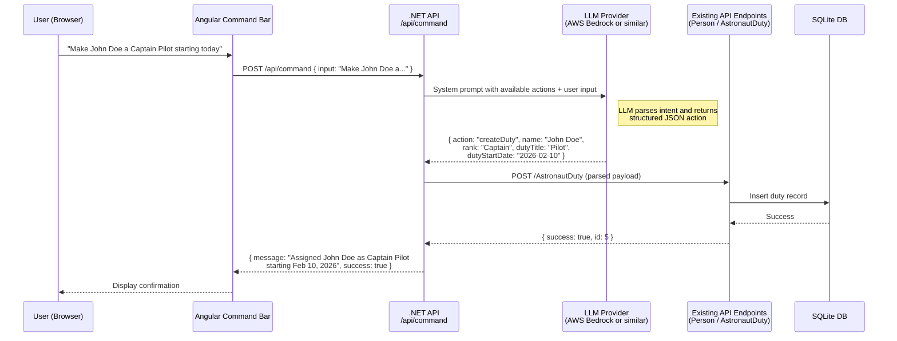
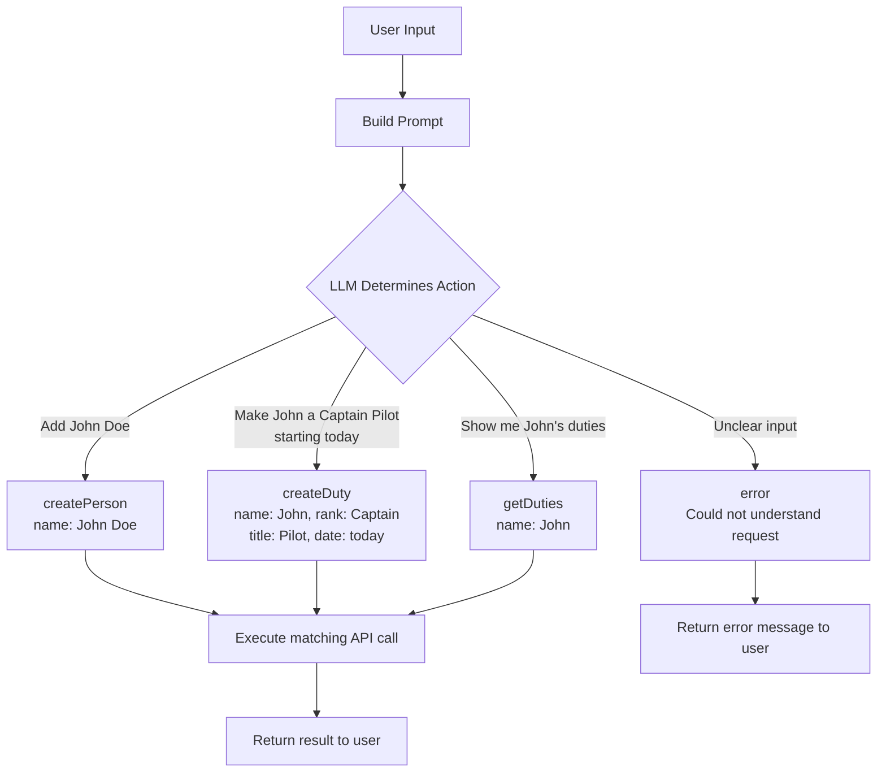

## Option 1: Natural Language Command Bar

```mermaid
sequenceDiagram
    participant User as User (Browser)
    participant Angular as Angular Command Bar
    participant API as .NET API<br>/api/command
    participant LLM as LLM Provider<br>(AWS Bedrock or similar)
    participant Endpoints as Existing API Endpoints<br>(Person / AstronautDuty)
    participant DB as SQLite DB

    User->>Angular: "Make John Doe a Captain Pilot starting today"
    Angular->>API: POST /api/command { input: "Make John Doe a..." }
    API->>LLM: System prompt with available actions + user input
    Note right of LLM: LLM parses intent and returns<br>structured JSON action
    LLM-->>API: { action: "createDuty", name: "John Doe",<br>rank: "Captain", dutyTitle: "Pilot",<br>dutyStartDate: "2026-02-10" }
    API->>Endpoints: POST /AstronautDuty (parsed payload)
    Endpoints->>DB: Insert duty record
    DB-->>Endpoints: Success
    Endpoints-->>API: { success: true, id: 5 }
    API-->>Angular: { message: "Assigned John Doe as Captain Pilot<br>starting Feb 10, 2026", success: true }
    Angular-->>User: Display confirmation
```

### How the LLM prompt works

```mermaid
flowchart TD
    A[User Input] --> B[Build Prompt]
    B --> C{LLM Determines Action}

    C -->|"Add John Doe"| D[createPerson<br>name: John Doe]
    C -->|"Make John a Captain Pilot<br>starting today"| E[createDuty<br>name: John, rank: Captain<br>title: Pilot, date: today]
    C -->|"Show me John's duties"| F[getDuties<br>name: John]
    C -->|Unclear input| G[error<br>Could not understand request]

    D --> H[Execute matching API call]
    E --> H
    F --> H
    G --> I[Return error message to user]
    H --> J[Return result to user]
```
